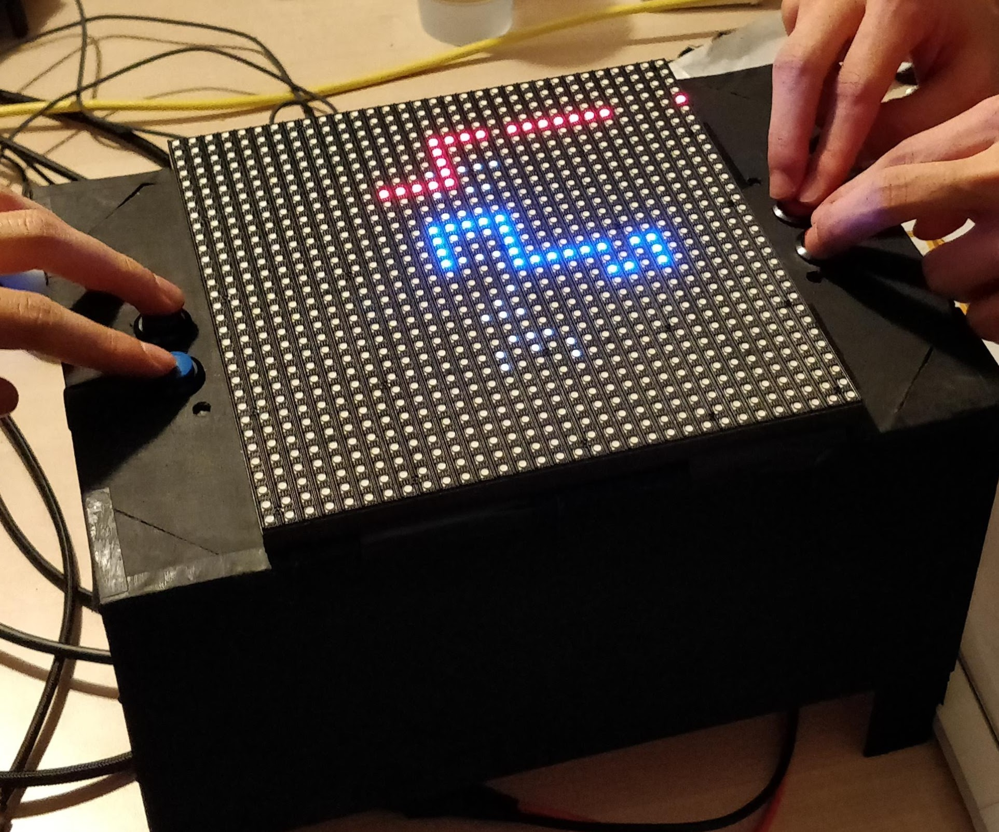

# projet1A

 

</img>

Projet de première année (Supélec) : réalisation d'une table de jeu (matrice de LEDs, raspberry pi).

## Lancer le jeu

`python3 main.py --led-no-hardware-pulse 1`

## Matériel

- Raspberry Pi 3 B+
- [Matrice de LED 32x32 ADAFRUIT](https://www.adafruit.com/product/607)

## Changelog

### 12/06

Seance de travail :

- Programmation du jeu en mode "auto"
- Peinture du support
- Redaction de la synthese

### 09/06

Decoupe du support pour pouvoir y mettre les boutons poussoirs.

### 25/05

Seance de travail :

- Connexion des cables a la table
- Test de l'alimentation
- Test de la librairie Python d'affichage
- Tout marche !

### 22/05

- Suite de la seance du 18/05

### 18/05

- Reception du materiel electronique
- Etude des documantations de la table / de la librairie Python

### 24/04

Réunion :

- Prochaines étapes
  - Alimentation de la table
  - Identifier le matériel qui manque
    - Plaques à essai vertes Supélec ?
    - Petite connectique -> demander au technicien
    - Farnell mieux pour commander -> idem
    - Tableur de ce qu'il faut acheter
  - Fil en nappe ? Contrôles
- Livrables
  - Tout ce que l'on produit doit être rédigé, document autoporteur
  - Perspective d'ingénieur : continuité du projet
    - Intro ac objectifs
    - CCL : cahier des charges respecté ? évolutions
  - Recherche documentaire : citer dans le compte-rendu
  - Annexes
- Penser le projet par étapes et évolutions futures
- Soutenance
  - Convaincre de l'intérêt du produit
  - Expliquer les perspectives
  - Démo

### 16/04

Objectifs de la première phase du projet :

- Contrôles
  - Nombre de pins disponibles pour les contrôles
  - On peut coder les contrôles sur 6 bits, suffisant ? Comment réduire cela ?
  - Système logique pour l'appui des touches
- Programmation
  - Boucle principale
  - Classe Perso
  - Simuler les contrôles
  - Mesurer les FPS

### 21/03

Commande de la matrice de LED.
Rédaction du cahier des charges.

### 19/03

Réunion :

- Définir la partie affichage, coût, puis le jeu.
- Produire un cahier des charges
- Site pour le matériel : [rs](https://fr.rs-online.com/)
