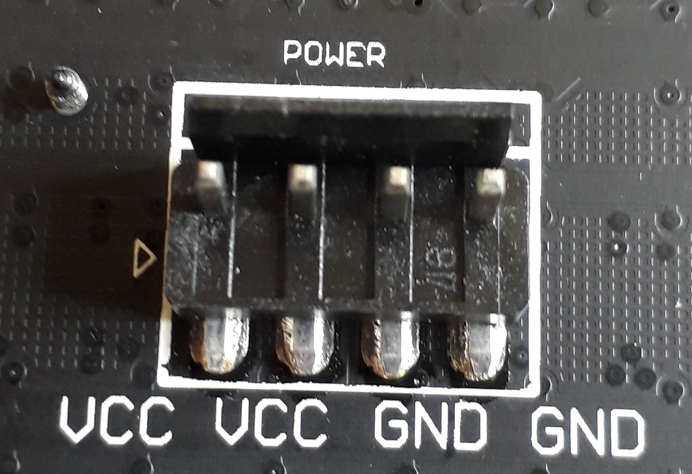

# Introduction

## Présentation

### Concept

Notre projet consiste en la réalisation d’une table de jeu de type arcade. Cette table permet à deux joueurs de s’affronter sur un jeu dans lequel chacun des joueurs contrôle un serpent (constitué d’une trainée de points) et doit obliger son adversaire à entrer en collision avec son propre serpent ou celui de son adversaire.

Ce jeu est connu sous le nom de « Achtung die Kurve ! » sorti initialement en 1995. Il a fait l’objet de nombreuses reprises depuis sa sortie et nous proposons de créer une nouvelle façon originale de jouer à ce jeu. L’utilisation d’une table à part entière offre plus de confort aux joueurs car les contrôles sont de vrais boutons au lieu de touches de clavier et les joueurs auront plus d’espace que s’ils devaient s’entasser à plusieurs autour d’un clavier d’ordinateur. De plus, la matrice de leds utilisée pour l’affichage permet d’obtenir un rendu graphique plus attrayant que celui d’un écran d’ordinateur.

### Règles du jeu

Au début d’une partie chaque joueur apparaît de manière aléatoire en un point de l’écran. A l’aide de deux boutons qui permettent des déplacements vers la gauche ou vers la droite chaque joueur va pouvoir déplacer ce point. Un joueur perd s’il entre en collision avec une traînée ou l’un des murs. La partie s’arrête lorsqu’il ne reste plus qu’un joueur en jeu qui est déclaré vainqueur.

## Méthodologie

### Outils de travail

Dans cette partie, nous allons présenter succintement les différents outils que nous avons utilisés pour réaliser ce projet.

#### Matériel

Pour effectuer les soudures entre les fils et les boutons poussoirs, nous avons utilisé une machine à souder disponible dans le local du club Comet. Par ailleurs, pour la confection de la table nous avons utilisé du matériel classique (cutter, règle, ciseaux...).

#### Logiciels

##### GitHub

Nous avons synchronisé les fichiers de notre projet avec GitHub pour ne rien perdre et pouvoir travailler efficacement en parallèle sur la rédaction.

##### Visual Studio Code

Nous avons choisi cet éditeur de texte pour coder le jeu pour sa simplicité et ses fonctionnalités.

##### Raspbian

Nous avons choisi Raspbian comme système d'exploitation pour la Raspberry Pi. Il s'agit d'une distribution de Linux sans interface graphique utilisable sans installations supplémentaires.

# Respect du cahier des charges

Les objectifs énoncés dans le cahier des charges ont été atteints.
Nous avons réalisé une table de jeu fonctionelle pour deux joueurs.
Chaque joueur dispose de deux boutons poussoirs pour controler ses mouvements dans le jeu.
Les connexions entre les différents composants de la table fonctionnent.
Enfin, nous avons également pu nous concentrer sur l'esthétique de la table.

Cependant, nous avons évolué par rapport au cahier des charges sur deux points :

1. La carte Raspberry que nous avons utilisée n'est pas la Raspberry Pi modèle B comportant 26 pins I/O dont nous disposions initialement. En effet, nous ne sommes pas parvenus à la faire fonctionner. Nous avons donc décidé d'en acheter une nouvelle et avons opté pour la Raspberry Pi 3 modèle B+ qui composée de 40 pins I/O, ce qui nous offrait plus de possibilités (notamment pouvoir augmenter le nombre de joueurs de 2 à 4).
2. Le programme python présent sur la carte se lance pas automatiquement au démarrage. Nous avons besoin de connecter un clavier d'ordinateur pour pouvoir entrer les identifiants nécessaires à la connexion au compte utilisateur, puis pour lancer le jeu avec les privilèges administrateurs.

# Conception

## Branchements

### Alimentation de la matrice LED

Les branchements à effectuer sur la matrice de LED concernent soit son alimentation, soit l'affichage. Adafruit, le constructeur de la matrice fournit une documentation à ce sujet sur son site disponible à l'adresse suivante :
[https://learn.adafruit.com/32x16-32x32-rgb-led-matrix/overview](https://learn.adafruit.com/32x16-32x32-rgb-led-matrix/overview)

L'ensemble des pixels allumés en blanc de la matrice peut consommer
jusqu'à 4A. Pour une utilisation plus classique, la matrice consomme en
moyenne 2A. On peut alimenter la matrice avec des courants plus grand (par
exemple 10A), par contre il est très important de bien l'alimenter sous 5V. Nous avons donc opté pour alimentation 5V/4000mA.

Au dos de la table, l'alimentation se fera au travers d'un connecteur de type
Molex (FIG. \ref{alim}).

{ width=50% }

On dispose du cable d'alimentation présenté en FIG. \ref{cable}.

{ width=50% }

Ce câble dispose de deux connecteurs de type Molex mais nous n'utiliserons qu'un seul des deux pour alimenter la matrice.

Pour connecter l'autre extrémité du câble avec notre alimentation, nous utiliserons un adaptateur comme sur la FIG. \ref{adapt}.

{ width=60% }

### Branchements entre la matrice LED et la Raspberry

Pour l'affichage, il faut connecter les pins de la Raspberry Pi au connecteur de pins de la matrice de LED.

Au dos de la matrice, il y a deux connecteurs de pin (INPUT à gauche,
OUTPUT à droite). Nous n'utiliserons pas le connecteur OUTPUT qui sert
dans les cas où l'on veut brancher plusieurs matrices de leds en parallèle.

Un connecteur possède 16 pins qui devront être reliés à la Raspberry Pi. Sa disposition est présentée en FIG. \ref{pins}, elle est annotée des numéros de pins de la Raspberry Pi (voir FIG. \ref{pinout}) auxquels les pins du connecteur devront être reliés.

{ width=50% }

### Branchements pour la Raspberry Pi

Pour pouvoir utiliser la Raspberry Pi, il faut l'alimenter par le port micro USB. Nous utilisons un chargeur $\SI{5}{V}, \SI{3000}{mA}$ recommandé par le constructeur.

La documentation des pins utilisables sur la Raspberry Pi est présentée en FIG. \ref{pinout}.

{ width=100% }

Le tableau suivant indique l'utilisations des pins de la Raspberry (numérotés de 1 à 40 selon la FIG. \ref{pinout}).

| Pin                                                  | Utilisation          |
| ---------------------------------------------------- | -------------------- |
| 6, 7, 11, 12, 13, 15, 16, 18, 19, 21, 22, 24, 23, 26 | Matrice LED          |
| 35                                                   | Bouton $G_1$         |
| 40                                                   | Bouton $D_1$         |
| 29                                                   | Bouton $G_2$         |
| 28                                                   | Bouton $D_2$         |
| 25, 30, 34, 39                                       | GND pour les boutons |

## Conception de la table

Pour réaliser notre table, nous sommes partis d'une cagette dont les dimensions permettaient de pouvoir y ajouter la matrice de LED et des boutons pour les deux joueurs. Nous avons ensuite percé cette table afin de pouvoir y intégrer les boutons poussoirs et faire passer les câbles nécessaires à l'alimentation et à l'affichage de la matrice de LED. Nous avons soudé les deux broches des boutons poussoirs à des fils pour pouvoir ensuite les connecter à la Raspberry Pi. Une des broches du bouton poussoir est relié à un pin GND de la Raspberry et l'autre à un pin normal.

Pour pouvoir déplacer la table plus facilement, nous y avons intégré un compartiment pour pouvoir y poser la Raspberry Pi. Enfin, nous avons travaillé son esthétique en bouchant certains trous et en la peignant.

## Conception du jeu

Nous avons utilisé Python 3.6.5 pour coder le jeu. On peut le lancer depuis la Raspberry Pi à l'aide de la commande `sudo python3 main.py --led-no-hardware-pulse 1`.

Le code du jeu est présenté en annexe. Nous détaillons dans cette partie les principes importants du jeu.

### Vocabulaire

- Frame : Désigne un état du jeu. Nous avons choisi une vitesse d'affichage de 5 frames par seconde pour le jeu et 20 pour les transitions.
- Map : Désigne la zone de jeu de taille 32x32.

### Librairies utilisées

On utilise les librairies `numpy` pour effectuer des maths basiques, `rpi-rgb-led-matrix` pour contrôler la matrice de LEDs, ainsi que `gpiozero` pour les boutons poussoirs.

### États du jeu

Il y a 4 états différents dans le jeu :

- `TITLE` $\rightarrow$ Il s'agit de l'écran titre. Pour démarrer il faut appuyer sur les deux boutons gauche.
- `START` $\rightarrow$ Transition en fondu vers le jeu.
- `GAME` $\rightarrow$ État correspondant au jeu.
- `LOSE` $\rightarrow$ Fin de la partie, transition vers `TITLE`.

\begin{center}
\begin{tikzpicture}[->, shorten >=1pt, node distance=3.75cm, on grid, >=stealth, initial text=, every state/.style={draw=blue!50, very thick, fill=blue!20}]

  \node[state]   (e0)               {TITLE};
  \node[state]   (e1) [right=of e0] {START};
  \node[state]   (e2) [below=of e1] {GAME};
  \node[state]   (e3) [below=of e0] {LOSE};

  \path (e0) edge node [above] {Appui $G_1, G_2$} (e1)
        (e1) edge node {Automatique} (e2)
        (e2) edge node [below] {Game Over} (e3)
        (e3) edge node {Automatique} (e0);

\end{tikzpicture}
\end{center}

### Serpents

Chaque joueur commence à une position aléatoire dans la moitié d'écran proche de lui.
Les joueurs vont laisser une traînée sur leur passage qu’il faudra éviter.
Ainsi, à mesure que la partie avance, la difficulté s’accroit du fait que le nombre de traînées crées par les joueurs augmente.

Cependant, la traînée n’est pas entièrement continue, des trous sont générés pour pouvoir éviter de se retrouver bloqué trop rapidement. Un joueur peut être dans l'un des 3 états suivants :

- `BLOC` $\rightarrow$ Le joueur a laissé un bloc derrière lui à la frame précédente. Il en laisse un nouveau avec une probabilité $p_{BLOC}$.
- `NONE` $\rightarrow$ Le joueur n'a pas laissé de bloc derrière lui à la frame précédente. Il n'en laisse toujours pas à cette frame avec une probabilité $p_{NONE}$.
- `TURN` $\rightarrow$ Le joueur vient de tourner et laisse systématiquement un bloc derrière lui pour que le joueur sache où il se trouve. Il repasse ensuite dans l'état `BLOC`.

On a le graphe d'états suivants :

\begin{center}
\begin{tikzpicture}[->, shorten >=1pt, node distance=3.5cm, on grid, >=stealth, initial text=, every state/.style={draw=blue!50, very thick, fill=blue!20}]

  \node[state]   (e0)               {$BLOC$};
  \node[state]   (e1) [right=of e0] {$NONE$};
  \node[state]   (e2) [below=of e0] {$TURN$};

  \path (e0) edge [loop above] node {$p_{BLOC}$} (e0)
             edge [bend left] node [above] {$1 - p_{BLOC}$} (e1)
        (e1) edge [bend left] node [below] {$1 - p_{NONE}$} (e0)
        (e1) edge [loop right] node {$p_{NONE}$} (e1)
        (e2) edge [bend left] node [left] {1} (e0);

\end{tikzpicture}
\end{center}

Cette méthode permet de générer des trous de manière plus efficace qu'en donnant simplement une probabilité à chaque bloc de ne pas apparaître. En effet, on ajuste $p_{BLOC}$ pour qu'un trou n'apparaisse pas trop souvent, puis on ajuste $p_{NONE}$ pour que lorsqu'un trou commence, il fasse souvent deux cases. Le résultat est alors plus naturel.

On a choisi $p_{BLOC} = 0.8$ et $p_{NONE} = 0.35$

### Objets

À chaque frame, il y a une chance de 4% pour qu'un objet apparaisse sur une case vide.
Nous avons ajouté deux objets à récupérer pour les joueurs :

- La gomme (blanc) : cet objet efface la trainée du joueur qui le récupère.
- La bombe (orange) : cet objet efface toutes les cases non vides dans un carré de côté 7 (la bombe se trouvant au centre de ce carré).

# Conclusion

## Conclusion sur le projet

<!-- C'était bien etc -->

## Évolutions futures

### Pour le jeu

La programmation d'un jeu est finie uniquement lorsqu'on le décide : on peut toujours ajouter de nouvelles fonctionnalités ou perfectionner ce qui a été fait.

De plus, on peut aisément télécharger des fichiers sur la Raspberry, on peut donc envisager la création de nouveaux jeux. En ce qui concerne le jeu que nous avons développé, nous pourrions l'améliorer de la manière suivante :

- Travailler l'image en incluant plus d'effets visuels
- Ajouter un mode solo où l'on joue contre l'ordinateur (on pourrait le démarrer en appuyant sur le bouton de droite)
- Augmenter la vitesse de déplacement des serpents avec le temps
- Ajouter un compteur de points pour faire des duels en plusieurs manches

### Pour la table

Le principal problème de notre système actuel concerne son alimentation. En effet, la table nécessite de brancher deux blocs d’alimentation pour fonctionner. Cela est dû au fait que nous alimentons directement les deux composants qui ont besoin d’électricité. Pour pallier à ce problème, il faudrait concevoir un bloc d’alimentation unique capable d’alimenter chacun des composants selon les contraintes qui lui sont propres.

Cependant, une telle solution ne serait pas forcément optimale car l’un des objectifs de notre projet était de pouvoir obtenir une table portative. Pour ce faire il faudrait envisager l’utilisation d’une batterie.

Voici quelques pistes pour améliorer la table :

- La rendre plus résistante, nous avons utilisé du carton assez fin
- Travailler la position des câbles pour que cela soit plus propre
- Retravailler la forme de la table pour que l'écran y soit intégré et non posé dessus
- Retravailler l'alimentation pour avoir un unique câble à brancher

# Annexes

## Inspiration

Nous avons eu l'idée de faire ce projet suite à un Tweet qui présentait une idée similaire : [https://twitter.com/shandiin/status/967583007463890944](https://twitter.com/shandiin/status/967583007463890944).

{ width=75% }

Nous avons finalement choisi une matrice plus petite qui était moins chère, mais nous avons travaillé la forme du projet. Sur le Tweet, on ne voit pas comment le jeu est controllé par exemple.

## Autres implémentations du jeu

## Code du jeu

### `main.py`

```python
""" main.py
Fichier principal
"""

import numpy as np
from util import Util
import player
from timer import Timer
from samplebase import SampleBase


class Tile():
    """Permet de gérer un carreau de la grille."""

    def __init__(self, y, x):
        self.type = "EMPTY"
        self.player = None
        self.x = x
        self.y = y

    def paint(self, screen):
        """Dessine le carreau."""
        if self.type == "PLAYER":
            p = self.player
            screen.SetPixel(self.y, self.x, p.COLOR[0], p.COLOR[1], p.COLOR[2])
        elif self.type == "ERASER":
            screen.SetPixel(self.y, self.x, 200, 200, 200)
        elif self.type == "BOMB":
            screen.SetPixel(self.y, self.x, 227, 119, 25)
        else:
            screen.SetPixel(self.y, self.x, 0, 0, 0)


class Snake(SampleBase):
    """Classe principale."""

    def __init__(self, *args, **kwargs):
        super(Snake, self).__init__(*args, **kwargs)
        self.tilemap = [[Tile(i, j) for j in range(32)] for i in range(32)]
        self.players = [player.Player(10, 10, 200, 0, self.tilemap),
                        player.Player(200, 10, 10, 17, self.tilemap)]
        self.timer = Timer(20)

    def run(self):
        screen = self.matrix.CreateFrameCanvas()

        # Boucle principale
        while True:

            # Écran titre
            if Util.GAME_STATE == "TITLE":

                screen.Clear()

                # Dessin du nom du jeu
                for pixel in Util.KURVE:
                    screen.SetPixel(7 + pixel[0], 18 + pixel[1],
                                    Util.GREY[0], Util.GREY[1], Util.GREY[2])
                    screen.SetPixel(24 - pixel[0], 13 - pixel[1],
                                    Util.GREY[0], Util.GREY[1], Util.GREY[2])

                screen = self.matrix.SwapOnVSync(screen)

                # Passage à l'état suivant
                if Util.P1_LEFT.is_pressed and Util.P2_LEFT.is_pressed:
                    Util.GAME_STATE = "START"

                self.timer.tick()

            # Transition en fondu
            if Util.GAME_STATE == "START":

                # Dessin du titre du jeu avec opacité décroissante
                for pixel in Util.KURVE:
                    a = 10 * Util.TICK  # Décalage d'opacité
                    screen.SetPixel(7 + pixel[0], 18 + pixel[1],
                                    - a + Util.GREY[0], - a + Util.GREY[1], - a + Util.GREY[2])
                    screen.SetPixel(24 - pixel[0], 13 - pixel[1],
                                    - a + Util.GREY[0], - a + Util.GREY[1], - a + Util.GREY[2])
                Util.TICK += 1

                # Passage à l'état suivant
                if Util.TICK == 18:
                    Util.TICK = 0
                    Util.GAME_STATE = "GAME"
                    self.players[1].DIR = "RIGHT"
                    self.players[0].DIR = "LEFT"
                    self.players[1].POS = np.array(
                        [-1 + np.random.randint(0, 16), np.random.randint(0, 32)])
                    self.players[0].POS = np.array(
                        [16 + np.random.randint(0, 16), np.random.randint(0, 32)])

                self.timer.tick()
                screen = self.matrix.SwapOnVSync(screen)

            # État principal
            if Util.GAME_STATE == "GAME":

                # Contrôles
                self.players[0].input(Util.P1_LEFT, Util.P1_RIGHT)
                self.players[1].input(Util.P2_LEFT, Util.P2_RIGHT)

                # MAJ de la position des joueurs
                self.players[0].update(self.tilemap)
                self.players[1].update(self.tilemap)

                # Dessin de la map
                for line in self.tilemap:
                    for tile in line:
                        tile.paint(screen)

                # Apparition des objets
                if np.random.randint(0, 100) < 4:
                    x = np.random.randint(0, 32)
                    y = np.random.randint(0, 32)
                    while self.tilemap[y][x].type != "EMPTY":
                        x = np.random.randint(0, 32)
                        y = np.random.randint(0, 32)

                    self.tilemap[y][x].type =
                        Util.ITEMS[np.random.randint(0, len(Util.ITEMS))]

                # Attente avant la frame suivante
                for i in range(4):
                    self.timer.tick()
                screen = self.matrix.SwapOnVSync(screen)

            # État du Game Over : transition
            if Util.GAME_STATE == "LOSE":

                # 128 frames d'animation
                # Util.TICK parcourt [-128, 0]
                # 64 premières frames : remplissage en carré autour du contact
                # 64 dernières frames : apparition de l'écran titre en carré

                if Util.TICK >= -64:
                    screen.Clear()
                    for j in range(32):
                        for i in range(32):
                            dist = np.abs(
                                j - Util.WIN_POS[1]) + np.abs(i - Util.WIN_POS[0])
                            if dist <= Util.TICK % 64 and Util.TICK < -64:
                                screen.SetPixel(j, i, 0, 0, 0)
                    for pixel in Util.KURVE:
                        screen.SetPixel(7 + pixel[0], 18 + pixel[1],
                                        Util.GREY[0], Util.GREY[1], Util.GREY[2])
                        screen.SetPixel(24 - pixel[0], 13 - pixel[1],
                                        Util.GREY[0], Util.GREY[1], Util.GREY[2])

                for j in range(32):
                    for i in range(32):
                        dist = np.abs(
                            j - Util.WIN_POS[1]) + np.abs(i - Util.WIN_POS[0])
                        if (dist <= Util.TICK % 64 and Util.TICK < -64) or \
                                (dist > Util.TICK % 64 and Util.TICK >= -64):
                            screen.SetPixel(
                                j, i, Util.WIN_COLOR[0], Util.WIN_COLOR[1], Util.WIN_COLOR[2])
                Util.TICK += 1

                # Passage à l'écran titre
                if Util.TICK == 0:
                    Util.GAME_STATE = "TITLE"
                    # On vide la map
                    for line in self.tilemap:
                        for tile in line:
                            tile.type = "EMPTY"

                self.timer.tick()
                screen = self.matrix.SwapOnVSync(screen)


# Fonction principale
if __name__ == "__main__":
    snake = Snake()
    if not snake.process():
        snake.print_help()

```

### `player.py`

```python
import numpy as np
from util import Util


class Player():
    """Classe définissant un joueur."""

    def __init__(self, c1, c2, c3, y_offset, tilemap):
        self.POS = np.array([16 - y_offset + np.random.randint(0, 16),
                             np.random.randint(0, 32)])
        self.COLOR = [c1, c2, c3]
        tilemap[self.POS[1]][self.POS[0]].player = self
        self.DIR = Util.DIRS[np.random.randint(0, 4)]
        self.LAST = "BLOC"
        self.TURNED_LAST = False

    def update(self, tilemap):
        """Appelé à chaque frame pour faire avancer le joueur."""

        # Calcul de la nouvelle position
        self.POS += Util.MOVE[self.DIR]
        self.POS = self.POS % 32
        tile = tilemap[self.POS[1]][self.POS[0]]

        # Case vide : le joueur bouge
        if tile.type == "EMPTY":
            # t, b, n : conditions pour laisser une trainée
            t = self.LAST == "TURN"
            b = self.LAST == "BLOC" and \
                np.random.randint(0, 100) <= Util.P_BLOC
            n = self.LAST == "NONE" and \
                np.random.randint(0, 100) > Util.P_NONE
            if t or b or n:
                self.LAST = "BLOC"
                tile.type = "PLAYER"
                tile.player = self
            else:
                self.LAST = "NONE"

        # Objet : gomme
        elif tile.type == "ERASER":
            # On efface la trainée du joueur
            for line in tilemap:
                for tile2 in line:
                    if tile2.type == "PLAYER" and tile2.player == self:
                        tile2.type = "EMPTY"
            tile.type = "PLAYER"
            tile.player = self

        # Objet : bombe
        elif tile.type == "BOMB":
            # On efface les tiles dans un carré de rayon 7
            for j in range(7):
                for i in range(7):
                    y = (j - 3 + tile.y) % 32
                    x = (i - 3 + tile.x) % 32
                    tilemap[y][x].type = "EMPTY"
            self.LAST = "TURN"

        # On se déplace sur la trainée d'un joueur : Game Over
        elif tile.type == "PLAYER":
            Util.GAME_STATE = "LOSE"
            Util.WIN_COLOR = [210 - self.COLOR[0], 10, 210 - self.COLOR[2]]
            Util.WIN_POS = [self.POS[0], self.POS[1]]
            Util.TICK = -128

    def input(self, left, right):
        """Vérifie si le joueur souhaite tourner."""
        if not self.TURNED_LAST:
            if left.is_pressed and not right.is_pressed:
                self.DIR = Util.LEFT[self.DIR]
                self.LAST = "TURN"
                self.TURNED_LAST = True
            if right.is_pressed and not left.is_pressed:
                self.DIR = Util.RIGHT[self.DIR]
                self.LAST = "TURN"
                self.TURNED_LAST = True
        else:
            self.TURNED_LAST = False

```

### `util.py`

```python
import numpy as np
from gpiozero import Button


class Util:
    """Variables utilitaires."""
    DIRS = ['UP', 'RIGHT', 'DOWN', 'LEFT']
    MOVE = {"UP": np.array([0, -1]),
            "RIGHT": np.array([1, 0]),
            "DOWN": np.array([0, 1]),
            "LEFT": np.array([-1, 0])}
    LEFT = {'UP': 'RIGHT', 'RIGHT': 'DOWN', 'DOWN': 'LEFT', 'LEFT': 'UP'}
    RIGHT = {'UP': 'LEFT', 'LEFT': 'DOWN', 'DOWN': 'RIGHT', 'RIGHT': 'UP'}
    P_BLOC = 80
    P_NONE = 35
    P1_LEFT = Button(19)
    P1_RIGHT = Button(21)
    P2_LEFT = Button(5)
    P2_RIGHT = Button(1)
    GAME_STATE = "TITLE"
    KURVE = [[0, 0], [0, 1], [0, 2], [0, 3], [0, 4], [1, 3], [2, 1], [2, 2], [2, 4],
             [4, 2], [4, 3], [4, 4], [5, 4], [6, 2], [6, 3], [6, 4],
             [8, 2], [8, 3], [8, 4], [9, 2],
             [11, 2], [12, 3], [13, 2], [13, 3], [13, 4],
             [15, 1], [15, 2], [15, 3], [16, 0], [16, 2], [16, 4], [17, 0], [17, 4]]
    GREY = [180, 180, 180]
    TICK = 0
    WIN_COLOR = [0, 0, 0]
    WIN_POS = [0, 0]
    ITEMS = ["ERASER", "BOMB"]

```

### `timer.py`

```python
""" timer.py
Utilitaire pour mesurer le temps.
"""

import time


class Timer:
    """Permet d'assurer les fps voulus."""

    def __init__(self, fps):
        self.__fps = fps
        self.__frame = 0
        self.__start = None

    def tick(self):
        """Attend jusqu'à la prochaine frame."""
        if self.__start is None:
            self.__start = time.perf_counter()
        self.__frame += 1
        target = self.__frame / self.__fps
        passed = time.perf_counter() - self.__start
        differ = target - passed
        if differ < 0:
            return True
        time.sleep(differ)
        return False

```